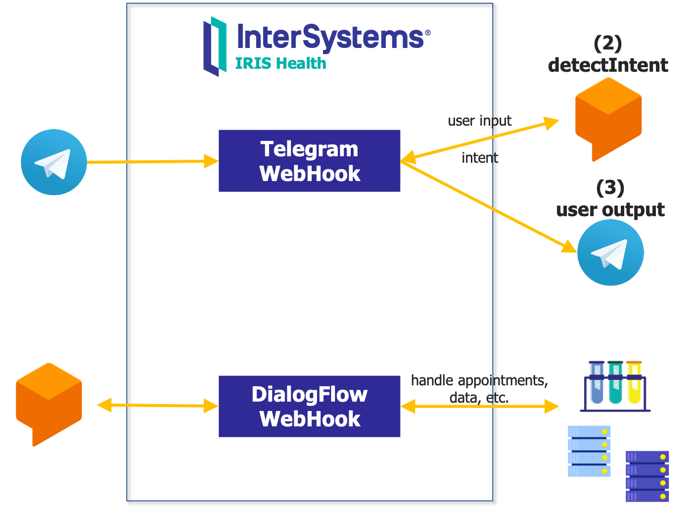
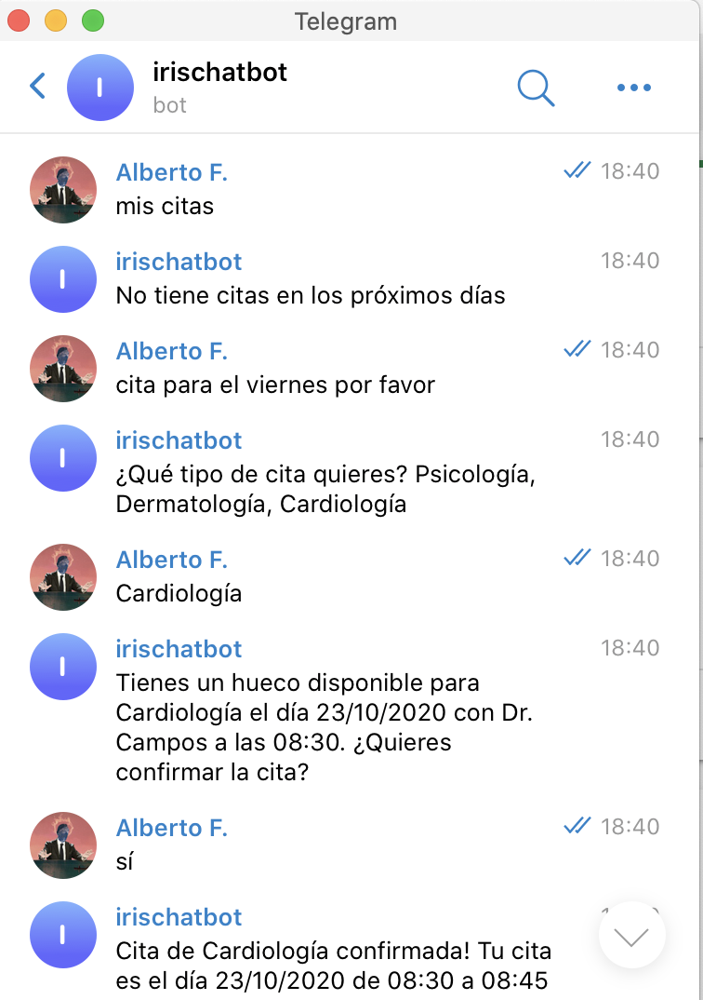

Simple IRIS chatbot using Telegram and Google Dialog Flow (*proof of concept*).


So it looks like that:


# SETUP
You need a public host with a domain name and HTTPS.

## VM in Compute Engine (Google Cloud)
Create a new VM that will be used to host IRIS + WebGateway instance on Google Cloud:

* Region: us-central1
* Config: E2 e2-medium (2 vCPU, 4GB)
* OS: Ubuntu 16.04 LTS
* Identity & API access: Allow full access to Cloud APIs
* Firewall: HTTP, HTTPS
* Register an external IP. Use this IP as your external IP.

## Google Domain + Google Cloud DNS
Register a DNS name pointing to the VM on Compute Engine: 

* Google Domain > Get a Domain (e.g. mydomain.dev)
* Cloud DNS > Create a new zone > Add an new `"A"`
  * Set DNS name (e.g. chatbot.mydomain.dev)
  * Set IPv4 address to your registered external IP.
* Google Domain > DNS > Custom servers > Configure the exact same servers as in Cloud DNS in the `"NS"` record in your zone.

## Install Docker on VM
Docker installation on Compute Engine VM:

```
sudo apt update
sudo apt install docker.io
sudo apt install docker-compose
sudo usermod -aG docker $USER
```

## Clone repo
Clone project repository on VM.

```
git config --global credential.helper cache
git clone https://github.com/isc-afuentes/iris-chatbot
```

## SSL Certificate (HTTPS)
Obtain [Let's encrypt](https://letsencrypt.org) certificates (free) that will be used in HTTPS connections. You only need that your host can be reached from outside.

Both Telegram and Google Dialog Flow requires HTTPS connections (not self-signed).

Full instructions can be found [here](https://certbot.eff.org/lets-encrypt/ubuntuxenial-apache).

1-Install certbot in the VM
```
sudo snap install core; sudo snap refresh core
sudo snap install --classic certbot
sudo ln -s /snap/bin/certbot /usr/bin/certbot
```

2-Run certbot in standalone mode (runs a temporary http server). This  will obtain the certificate files signed by [Let's encrypt](https://letsencrypt.org).
```
sudo certbot certonly --standalone --preferred-challenges http -d chatbot.mydomain.dev
```

3-Copy certificate files into local project directory, in the webgateway context (this will be used during the project building phase):
```
sudo cp /etc/letsencrypt/live/chatbot.mydomain.dev/fullchain.pem webgateway/ssl-cert.pem
sudo cp /etc/letsencrypt/live/chatbot.mydomain.dev/privkey.pem webgateway/ssl-cert.key
```                   

## Google Dialog Flow API Credentials
Enable Google Dialog Flow API on Google Cloud.

* APIS & Services > Enable Google Dialog Flow API.
* IAM & Admin > Service Accounts
  * Select your automatically created Dialog Flow service account (once you have enabled the service).
  * Create a key for the account and download it in JSON format.
  * Place the downloaded file in project root directory as `google-credentials.json`.

## Cloud Translation API Credentials
Enable Cloud Translation API on Google Cloud (this is used only for non-supported Dialog Flow languages like catalan).

* Apis & Services > Enable Cloud Translation API
* Apis & Create API Key (restricted to Cloud Translate).
* Write down your Cloud Translate API key.

## Google Dialog Flow Agent
In Google Dialog Flow Essentials, create a new agent and import from zip.

Check *Fullfillment* URL and credentials.

## Telegram Bot
1-Create a bot using [BotFather](https://t.me/botfather) bot.
```
/newbot
```
Write down your generated Bot token.

2-Set up a webhook for your bot, so each time a user sends your bot a message it will be processed by your webhook:
```
https://api.telegram.org/bot<token>/setWebhook?url=https://chatbot.mydomain.dev/chatbot/telegram/webhook
```

3-Set up some commands for your bot using [BotFather](https://t.me/botfather) bot:
```
/setcommands
registro - Registrar usuario
ayuda - Ayuda
```

## Get InterSystems container images
Download container images that will be used for project building.

Log-in into https://containers.intersystems.com/ using your WRC credentials and get a token. You will need this to download registered images.

```
sudo docker pull store/intersystems/iris-community:2020.2.0.211.0
sudo docker login -u="user" -p="token" containers.intersystems.com
sudo docker pull containers.intersystems.com/intersystems/webgateway:2020.2.0.211.0
```

## Set IRIS instance password
Set the password for the IRIS instance using a local environment file.

Create a file called `.env` in the repository root directory, like: 
```
ISC_PASSWORD=somepassword
```

## Build & run
```
docker-compose build
docker-compose up -d
```

## IRIS credentials for Telegram and Cloud Translate
Create IRIS credentials for your Telegram Bot and Cloud Translate service.

* IRIS > Chatbot > Create Credentials > `TelegramBot` > use your Telegram bot token as password.
* IRIS > Chatbot > Create Credentials > `GoogleTranslate` > user you Cloud Translate API key as password.
