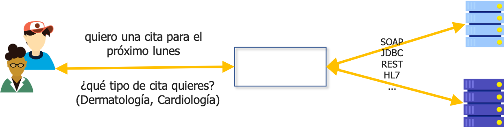
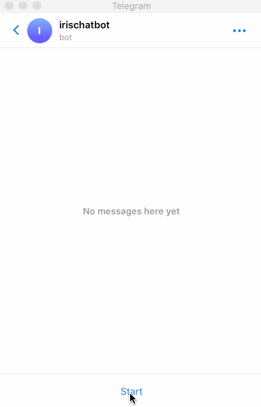
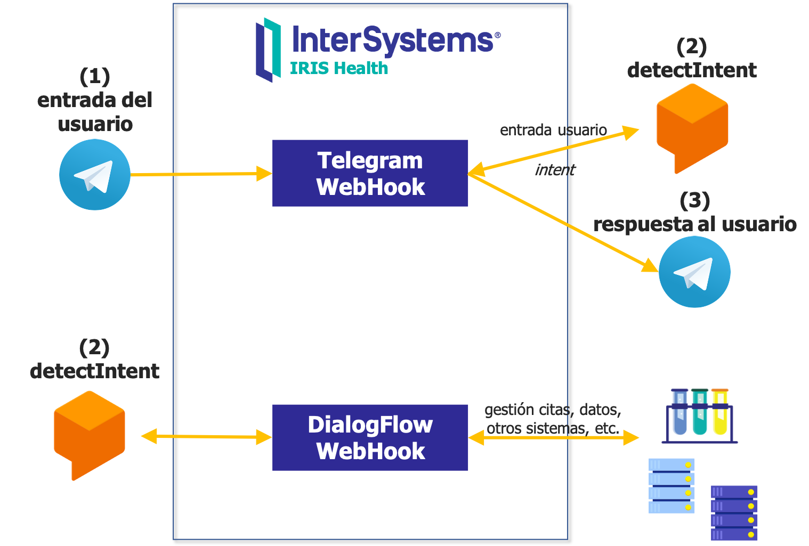

Aquí encontrarás el material utilizado en el [Webinar - Desarrolla un Chatbot con Google DialogFlow, Telegram e InterSystems IRIS](https://comunidadintersystems.com/webinar-desarrolla-un-chatbot), échale un vistazo al [vídeo](https://www.youtube.com/watch?v=5L8j1SPYg4w&feature=youtu.be)👈. 

Idiomas: [🇺🇸](README.md)[🇪🇸](README.es.md)

# ¿Qué vamos a desarrollar?

Vamos a desarrollar un asistente que ayude al usuario a interactuar con un sistema de citas utilizando diálogos en lenguaje natural.



El aspecto final que tendrá el chatbot desde el punto de vista del usuario es este:



Y esta es la arquitectura, con los diferentes servicios, que vamos a usar:



# Instalación
Necesitas servidor un accesible en internet, con un nombre de dominio registrado y HTTPS.

## VM en Compute Engine (Google Cloud)
Crea una nueva VM que utilizarás para albergar las instancias de InterSystems IRIS y un Webgateway en Google Cloud:

* Region: us-central1
* Config: E2 e2-medium (2 vCPU, 4GB)
* S.O.: Ubuntu 16.04 LTS
* Identidad & acceso API: Acceso compleot a las Cloud APIs
* Firewall: HTTP, HTTPS
* Registrar una IP externa. Utilizar esa IP externa como IP de la VM.

## Google Domain + Google Cloud DNS
Registra un nombre DNS que apunte a la VM que se ejecuta en Compute Engine: 

* Google Domain > Obtener un dominio (e.g. mydomain.dev)
* Cloud DNS > Crear una nueva zona > Añadir nuevo registro `"A"`
  * Configurar nombre DNS (e.g. chatbot.mydomain.dev)
  * Configurar dirección IPv4 a la IP externa que registrada que utiliza la VM.
* Google Domain > DNS > Servidores personalizados > Configurar exactamente los mismos servidores que en Cloud DNS en el registro `"NS"` de tu zona.

## Instalar Docker en la VM
Instalación de docker en la VM de Compute Engine:

```
sudo apt update
sudo apt install docker.io
sudo apt install docker-compose
sudo usermod -aG docker $USER
```

## Clonar repositorio
Clonar repositorio en la VM.
```
git config --global credential.helper cache
git clone https://github.com/es-comunidad-intersystems/webinar-chatbot.git
```

## Certificados (HTTPS)
Obtener certificados (gratuitos) de [Let's encrypt](https://letsencrypt.org) que utilizaremos para las conexiones HTTPS. Lo único que necesitamos es que el servidor sea accesible desde el exterior.

Tanto Telegram como Google DialogFlow requieren conexiones HTTPS (y no pueden utilizar certificados auto-firmados).

Las instrucciones completas las puedes encontrar [aquí](https://certbot.eff.org/lets-encrypt/ubuntuxenial-apache).

1-Instalar certbot en la VM
```
sudo snap install core; sudo snap refresh core
sudo snap install --classic certbot
sudo ln -s /snap/bin/certbot /usr/bin/certbot
```

2-Ejecutar certbot en modo standalone (ejecuta un servidor http temporal). Con esto obtendremos los certificados firmados por [Let's encrypt](https://letsencrypt.org).
```
sudo certbot certonly --standalone --preferred-challenges http -d chatbot.mydomain.dev
```

3-Copiar los ficheros de los certificados al directorio del proyecto local, en el contexto del webgateway (estos certificados se utilizarán durante la fase de construcción de la imagen del webgateway):
```
sudo cp /etc/letsencrypt/live/chatbot.mydomain.dev/fullchain.pem webgateway/ssl-cert.pem
sudo cp /etc/letsencrypt/live/chatbot.mydomain.dev/privkey.pem webgateway/ssl-cert.key
```                   

## Credenciales de Google Dialog Flow API
Habilitar las API de Google Dialog Flow en Google Cloud.

* APIS & Servicios > Habilitar Google Dialog Flow API.
* IAM & Admin > Cuentas de Servicio
  * Seleccionar la cuenta de servicio de Dialog Flow que se ha creado automáticamente (una vez activas el servicio).
  * Crear una clave para la cuenta y descargala en formato JSON.
  * Copiar el fichero JSON descargado en la raíz del proyecto con el nombre `google-credentials.json`.

## Credenciales de Cloud Translation API
Habilitar la API de Cloud Translation en Google Cloud (esta parte sólo es necesaria si quieres traducir idiomas que no están soportados nativamente en Google Dialog Flow como el catalán).

* Apis & Servicios > Habilitar Cloud Translation API.
* Apis & Crear una API Key (restringida a Cloud Translate).
* Copia tu Cloud Translate API key.

## Agente de Google Dialog Flow
En Google Dialog Flow Essentials, crea un nuevo agente e importa los datos del directorio [dialogflow-agent](./dialogflow-agent).

Comprueba la URL de *Fullfillment* y las credentials.

## Telegram Bot
1-Crea un bot de Telegram usando [BotFather](https://t.me/botfather) bot.
```
/newbot
```
Copia el token que se ha generado para tu Bot.

2-Configura el webhook para el bot, de forma que cada vez que un usuario envíe al bot un mensaje, se procese en el webhook:
```
https://api.telegram.org/bot<token>/setWebhook?url=https://chatbot.mydomain.dev/chatbot/telegram/webhook
```

3-Configura algunos comandos para el bot usando [BotFather](https://t.me/botfather):
```
/setcommands
registro - Registrar usuario
ayuda - Ayuda
```

## Obtener las imágenes de contenedores InterSystems
Descargar las imágenes de contenedores que se utilizarán durante la fase de construcción del proyecto.

Accede a https://containers.intersystems.com/ con tus credenciales WRC y obten un token. Necesitas este paso para acceder a las imágenes registradas.

```
sudo docker pull store/intersystems/iris-community:2020.2.0.211.0
sudo docker login -u="user" -p="token" containers.intersystems.com
sudo docker pull containers.intersystems.com/intersystems/webgateway:2020.2.0.211.0
```

## Configura un password para la instancia IRIS
Configura un password para la instancia IRIS utilizando un fichero de entorno local.

Crea un fichero llamado `.env` en el directorio raíz del repositorio, con un contenido como este: 
```
ISC_PASSWORD=somepassword
```

## Construir y ejecutar el proyecto
```
docker-compose build
docker-compose up -d
```

## Configura en IRIS las credenciales para Telegram y Cloud Translate
Crea en IRIS las credenciales del Bot de Telegram y el Cloud Translate Service.

* IRIS > Chatbot > Crear Credenciales > `TelegramBot` > introduce el token del Bot de Telegram como password.
* IRIS > Chatbot > Create Credenciales > `GoogleTranslate` > utiliza la API key de Cloud Translate como password.


## Resetear los datos de la demo
```
write ##class(Chatbot.Util).ResetDemo()
```
